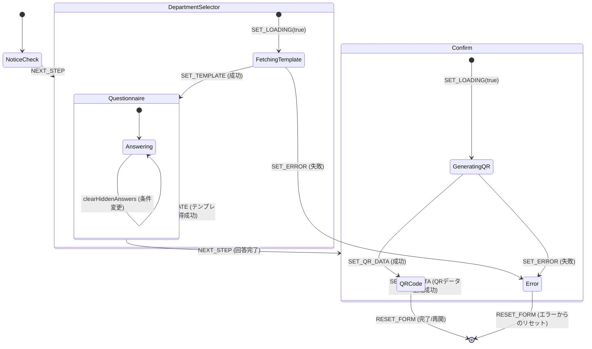
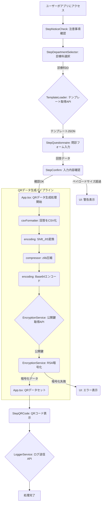

# input-app 構成理解マップ（Lv2：構造 + 処理レベル）

## 構成理解マップの目的

このドキュメントは、input-app のコード構造と処理の流れを中程度の緻密度で整理し、開発者や保守担当者が理解しやすくすることを目的としています。

---

## 1. useReducer の状態遷移ロジック（本フェーズの対象）

`App.tsx` 内の `useReducer` は、アプリケーション全体のフォーム状態 (`FormState`) を管理し、ユーザーのアクション (`FormAction`) に基づいて状態を遷移させます。

### `FormState` のプロパティ構造

`FormState` は、アプリケーションの現在の状態を保持するオブジェクトです。主要なプロパティは以下の通りです。

-   **`currentStep: number`**: 現在表示されているステップのインデックス。
-   **`answers: { [key: string]: any }`**: ユーザーが入力した問診の回答をキーと値のペアで保持するオブジェクト。キーは質問ID、値は回答内容。
-   **`template: Template | null`**: 現在選択されている診療科に対応する問診テンプレートオブジェクト。`TemplateLoader` から取得される。
-   **`qrData: string | null`**: 生成されたQRコードのデータ文字列。
-   **`error: string | null`**: エラーメッセージ。
-   **`isLoading: boolean`**: データロード中かどうかのフラグ。

### `FormAction` タイプとそれに対応する状態遷移の説明

`FormAction` は、`useReducer` の `dispatch` 関数に渡されるアクションオブジェクトです。各アクションは、特定のイベントやユーザー操作に対応し、`FormState` を更新します。

-   **`type: 'NEXT_STEP'`**:
    -   **説明**: 次のステップへ進む。`currentStep` をインクリメントする。
    -   **トリガー箇所**: 各ステップコンポーネント（例: `StepNoticeCheck`, `StepDepartmentSelector`, `StepQuestionnaire`, `StepConfirm`）で、ユーザーが「次へ」ボタンなどをクリックした際。
-   **`type: 'PREV_STEP'`**:
    -   **説明**: 前のステップへ戻る。`currentStep` をデクリメントする。
    -   **トリガー箇所**: 各ステップコンポーネントで、ユーザーが「戻る」ボタンなどをクリックした際。
-   **`type: 'SET_ANSWERS'`**:
    -   **説明**: ユーザーの回答を更新する。`payload` に新しい回答オブジェクトが含まれる。
    -   **トリガー箇所**: `StepQuestionnaire` でユーザーが質問に回答した際。
-   **`type: 'SET_TEMPLATE'`**:
    -   **説明**: 問診テンプレートを設定する。`payload` にテンプレートオブジェクトが含まれる。
    -   **トリガー箇所**: `StepDepartmentSelector` で診療科が選択され、`TemplateLoader` からテンプレートが正常に取得された際。
-   **`type: 'SET_QR_DATA'`**:
    -   **説明**: QRコードデータを設定する。`payload` にQRデータ文字列が含まれる。
    -   **トリガー箇所**: `App.tsx` でQRデータ生成パイプラインが完了し、データが準備できた際。
-   **`type: 'SET_ERROR'`**:
    -   **説明**: エラーメッセージを設定する。`payload` にエラー文字列が含まれる。
    -   **トリガー箇所**: API呼び出しの失敗、データ処理中のエラーなど。
-   **`type: 'SET_LOADING'`**:
    -   **説明**: ローディング状態を設定する。`payload` にブール値が含まれる。
    -   **トリガー箇所**: API呼び出しの開始時 (`true`) と終了時 (`false`)。
-   **`type: 'RESET_FORM'`**:
    -   **説明**: フォームの状態を初期値にリセットする。
    -   **トリガー箇所**: アプリケーションの再開、または特定の条件でフォームをクリアする必要がある場合。

### `clearHiddenAnswers()` などの重要な処理のトリガー箇所

`clearHiddenAnswers()` は、`StepQuestionnaire` 内で、`conditional_on` の条件が満たされなくなった際に、非表示になった質問の回答を `answers` から削除するために呼び出されます。これにより、不要なデータがQRコードにエンコードされるのを防ぎます。

### 状態遷移のMermaid図（stateDiagram-v2）



---

## 2. ステップごとの処理構造と副作用分析

各コンポーネント (`StepNoticeCheck.tsx`, `StepDepartmentSelector.tsx`, `StepQuestionnaire.tsx`, `StepConfirm.tsx`, `StepQRCode.tsx`) が担う**処理責務**と、それに紐づく `App.tsx` 側のロジック（副作用、dispatch呼び出し、API連携）を詳細に記述します。

### StepNoticeCheck.tsx

-   **責務**: 注意事項の表示と同意の確認。
-   **イベントトリガー**:
    -   `onNext`: ユーザーが「同意して次へ」ボタンをクリック。
-   **内部処理 or dispatchで呼び出される関数**:
    -   `App.tsx` の `dispatch({ type: 'NEXT_STEP' })` を呼び出す。
-   **発生する副作用**: なし。
-   **エラー発生時の挙動**: なし。
-   **`FormState` の更新内容**:
    -   `currentStep`: `currentStep + 1` (次のステップへ遷移)。
-   **ユーザー視点でのUI上の動きとの対応**:
    -   注意事項が表示され、ユーザーが同意チェックボックスをオンにして「同意して次へ」ボタンをクリックすると、画面が次のステップ（診療科選択）に切り替わる。

### StepDepartmentSelector.tsx

-   **責務**: 診療科の選択と、それに伴う問診テンプレートの取得。
-   **イベントトリガー**:
    -   `onSelectDepartment`: ユーザーが診療科を選択。
-   **内部処理 or dispatchで呼び出される関数**:
    -   `App.tsx` の `handleSelectDepartment(departmentId: string)` を呼び出す。
-   **発生する副作用**:
    -   `handleSelectDepartment` 内で `TemplateLoader.fetchTemplate(departmentId)` が呼び出され、外部APIから問診テンプレートを取得する。
    -   API呼び出し中は `dispatch({ type: 'SET_LOADING', payload: true })` でローディング状態になる。
    -   API呼び出し完了後、`dispatch({ type: 'SET_LOADING', payload: false })` でローディング状態を解除する。
-   **エラー発生時の挙動**:
    -   テンプレート取得APIが失敗した場合、`dispatch({ type: 'SET_ERROR', payload: errorMessage })` でエラーメッセージを設定し、エラーUIが表示される。
-   **`FormState` の更新内容**:
    -   `isLoading`: `true` (API呼び出し開始時) -> `false` (API呼び出し完了時)。
    -   `template`: 取得したテンプレートオブジェクト (成功時) または `null` (失敗時)。
    -   `error`: エラーメッセージ (失敗時) または `null` (成功時)。
    -   `currentStep`: テンプレート取得成功後、`currentStep + 1` (問診フォームへ遷移)。
-   **ユーザー視点でのUI上の動きとの対応**:
    -   診療科選択画面が表示され、ユーザーが診療科を選択すると、ローディング表示が出て、テンプレートの取得が始まる。成功すると問診フォーム画面に切り替わる。失敗するとエラーメッセージが表示される。

### StepQuestionnaire.tsx

-   **責務**: テンプレートJSONに基づいた質問の動的レンダリングと回答の収集、条件に応じた質問の表示/非表示制御。
-   **イベントトリガー**:
    -   `onAnswersChange`: ユーザーが質問に回答（入力値変更）。
    -   `onNext`: ユーザーが「次へ」ボタンをクリック。
    -   `onBack`: ユーザーが「戻る」ボタンをクリック。
-   **内部処理 or dispatchで呼び出される関数**:
    -   `onAnswersChange` で `App.tsx` の `dispatch({ type: 'SET_ANSWERS', payload: newAnswers })` を呼び出す。
    -   `onNext` で `App.tsx` の `dispatch({ type: 'NEXT_STEP' })` を呼び出す。
    -   `onBack` で `App.tsx` の `dispatch({ type: 'PREV_STEP' })` を呼び出す。
    -   内部で `clearHiddenAnswers()` が呼び出され、`conditional_on` の条件が満たされなくなった質問の回答を `FormState.answers` から削除する。
-   **発生する副作用**: なし（API呼び出しは行わない）。
-   **エラー発生時の挙動**:
    -   入力値のバリデーションエラーはUI上で表示されるが、`FormState.error` には影響しない。
-   **`FormState` の更新内容**:
    -   `answers`: ユーザーの入力に応じてリアルタイムに更新される。
    -   `currentStep`: `NEXT_STEP` または `PREV_STEP` アクションにより更新される。
-   **ユーザー視点でのUI上の動きとの対応**:
    -   問診フォームが表示され、ユーザーが質問に回答すると、その内容が即座に反映される。特定の回答によって、関連する質問が表示されたり非表示になったりする。全ての必須質問に回答し「次へ」をクリックすると確認画面へ、または「戻る」で診療科選択画面へ戻る。

### StepConfirm.tsx

-   **責務**: 入力された回答内容の確認表示とQRコード生成のトリガー。
-   **イベントトリガー**:
    -   `onConfirm`: ユーザーが「QRコードを生成」ボタンをクリック。
    -   `onBack`: ユーザーが「戻る」ボタンをクリック。
-   **内部処理 or dispatchで呼び出される関数**:
    -   `onConfirm` で `App.tsx` の `handleConfirm()` を呼び出す。
    -   `onBack` で `App.tsx` の `dispatch({ type: 'PREV_STEP' })` を呼び出す。
-   **発生する副作用**:
    -   `handleConfirm` 内で以下の処理が順次実行される:
        1.  `csvFormatter.formatToCsv()`: 回答をCSV形式に変換。
        2.  `encoding.toShiftJIS()`: Shift_JISに変換。
        3.  `compressor.compress()`: zlibで圧縮。
        4.  `encoding.uint8ToBase64()`: Base64エンコード。
        5.  `EncryptionService.fetchPublicKey()`: 公開鍵取得API呼び出し。
        6.  `EncryptionService.encryptData()`: RSA暗号化。
        7.  `LoggerService.sendLog()`: ログ送信API呼び出し。
    -   各処理の前後で `dispatch({ type: 'SET_LOADING', payload: true/false })` が呼び出される。
-   **エラー発生時の挙動**:
    -   QRデータ生成パイプラインの途中でエラーが発生した場合、`dispatch({ type: 'SET_ERROR', payload: errorMessage })` でエラーメッセージを設定し、エラーUIが表示される。
    -   特に、暗号化データがペイロードサイズを超過した場合もエラーとして扱われる。
-   **`FormState` の更新内容**:
    -   `isLoading`: `true` (QR生成開始時) -> `false` (QR生成完了時)。
    -   `qrData`: 生成されたQRデータ文字列 (成功時) または `null` (失敗時)。
    -   `error`: エラーメッセージ (失敗時) または `null` (成功時)。
    -   `currentStep`: QRデータ生成成功後、`currentStep + 1` (QRコード表示へ遷移)。
-   **ユーザー視点でのUI上の動きとの対応**:
    -   入力内容の確認画面が表示され、ユーザーが「QRコードを生成」をクリックすると、ローディング表示が出てQRコードの生成が始まる。成功するとQRコードが表示される画面に切り替わる。失敗するとエラーメッセージが表示される。

### StepQRCode.tsx

-   **責務**: 生成されたQRコードの表示。
-   **イベントトリガー**: なし（表示のみ）。
-   **内部処理 or dispatchで呼び出される関数**: なし。
-   **発生する副作用**: なし。
-   **エラー発生時の挙動**: なし。
-   **`FormState` の更新内容**: なし。
-   **ユーザー視点でのUI上の動きとの対応**:
    -   QRコードが表示される。ユーザーはQRコードを読み取る。

### ステップ間の副作用付き処理フロー

```mermaid
graph TD
    A[ユーザーがアプリにアクセス] --> B(StepNoticeCheck)
    B -- onNext --> C(App.tsx: dispatch(NEXT_STEP))
    C --> D(StepDepartmentSelector)
    D -- onSelectDepartment(departmentId) --> E(App.tsx: handleSelectDepartment)
    E -- dispatch(SET_LOADING(true)) --> F{TemplateLoader.fetchTemplate(departmentId)}
    F -- 成功 --> G(App.tsx: dispatch(SET_TEMPLATE(template)))
    G --> H(App.tsx: dispatch(SET_LOADING(false)))
    H --> I(App.tsx: dispatch(NEXT_STEP))
    I --> J(StepQuestionnaire)
    F -- 失敗 --> K(App.tsx: dispatch(SET_ERROR(error)))
    K --> L(App.tsx: dispatch(SET_LOADING(false)))
    L --> M(エラー表示)

    J -- onAnswersChange(newAnswers) --> N(App.tsx: dispatch(SET_ANSWERS(newAnswers)))
    J -- onNext --> O(App.tsx: dispatch(NEXT_STEP))
    O --> P(StepConfirm)
    J -- onBack --> Q(App.tsx: dispatch(PREV_STEP))
    Q --> D

    P -- onConfirm --> R(App.tsx: handleConfirm)
    R -- dispatch(SET_LOADING(true)) --> S(QRデータ生成パイプライン開始)
    S --> T{EncryptionService.fetchPublicKey()}
    T -- 成功 --> U(EncryptionService.encryptData)
    U --> V(LoggerService.sendLog)
    V --> W(App.tsx: dispatch(SET_QR_DATA(qrData)))
    W --> X(App.tsx: dispatch(SET_LOADING(false)))
    X --> Y(App.tsx: dispatch(NEXT_STEP))
    Y --> Z(StepQRCode)
    T -- 失敗 --> AA(App.tsx: dispatch(SET_ERROR(error)))
    AA --> BB(App.tsx: dispatch(SET_LOADING(false)))
    BB --> M
    U -- 暗号化失敗/サイズ超過 --> CC(App.tsx: dispatch(SET_ERROR(error)))
    CC --> DD(App.tsx: dispatch(SET_LOADING(false)))
    DD --> M

    P -- onBack --> EE(App.tsx: dispatch(PREV_STEP))
    EE --> J

    Z -- 完了 --> FF(App.tsx: dispatch(RESET_FORM))
    FF --> A

```

---

## 3. データ変換および暗号処理パイプライン（handleConfirm）

このセクションでは、`App.tsx` 内の `handleConfirm()` におけるデータ変換処理の全工程を明示し、それぞれのユーティリティ関数の責務・入力・出力・ライブラリ依存を記載します。

### パイプライン全体図（Mermaid）

```mermaid
graph TD
    A[FormState.answers] --> B[formatToCsv]
    B --> C[toShiftJIS]
    C --> D[compress (zlib)]
    D --> E[uint8ToBase64]
    E --> F[fetchPublicKey]
    F --> G[encryptData (RSA)]
    G --> H[setQrData() で画面表示]
```

### 各ステップの詳細

#### 1. `formatToCsv(answers: Record<string, any>): string`
-   **責務**: フォームの回答をCSV形式に変換。
-   **実装場所**: `src/utils/csvFormatter.ts`
-   **出力例**: `"問1","回答1"\n"問2","回答2"` のような文字列。
-   **備考**: 回答はソートされ、選択肢のインデックスや座標もフォーマットされる。

#### 2. `toShiftJIS(csv: string): Uint8Array`
-   **責務**: CSV文字列をShift_JISでエンコード。
-   **ライブラリ**: `encoding-japanese`
-   **出力**: `Uint8Array` バイト列。
-   **注意**: Shift_JISに変換できない文字は「?」等に置換される場合あり。

#### 3. `compress(data: Uint8Array): Uint8Array`
-   **責務**: Shift_JISバイト列を zlib 圧縮。
-   **ライブラリ**: `pako`（DEFLATE圧縮）
-   **出力**: 圧縮済みバイナリデータ（`Uint8Array`）。

#### 4. `uint8ToBase64(data: Uint8Array): string`
-   **責務**: バイナリをBase64文字列に変換。
-   **ライブラリ**: 自前または標準のエンコーディング処理。
-   **出力**: QRコードに埋め込む文字列（未暗号）。

#### 5. `fetchPublicKey()`
-   **責務**: 公開鍵の取得。
-   **詳細**: 第3回で詳細を記述予定。

#### 6. `encryptData(base64: string, publicKey: string): string`
-   **責務**: Base64データをRSA暗号化（PKCS#1 OAEP）。
-   **ライブラリ**: `jsencrypt`
-   **出力**: 暗号化済み文字列（QRコードとしてエンコード可）。

### エラーハンドリングとペイロード上限検証

-   `base64.length` が `template.max_payload_bytes` を超えた場合:
    -   ユーザーにエラー表示: 「QRコードの許容サイズを超過しました」
    -   ログ送信（`sendLog`）も実施される。
-   暗号化失敗時:
    -   "Encryption failed" を表示。
    -   ログ送信を実行。

---


### 4. ディレクトリ構成（簡略）

```
input-app/
├── public/
│   └── index.html          // アプリケーションのエントリーポイントHTML
├── src/
│   ├── main.tsx            // Reactアプリケーションのマウント
│   ├── App.tsx             // アプリケーションのメインロジック、ステップ管理、状態管理
│   ├── components/         // UIコンポーネント群
│   │   ├── StepNoticeCheck.tsx
│   │   ├── StepDepartmentSelector.tsx
│   │   ├── StepQuestionnaire.tsx
│   │   ├── StepConfirm.tsx
│   │   └── StepQRCode.tsx
│   ├── services/           // 外部サービス連携ロジック
│   │   ├── EncryptionService.ts
│   │   ├── LoggerService.ts
│   │   └── TemplateLoader.ts
│   ├── utils/              // 汎用ユーティリティ関数
│   │   ├── compressor.ts
│   │   ├── csvFormatter.ts
│   │   ├── encoding.ts
│   └── types/              // TypeScriptの型定義
│       └── Questionnaire.ts
└── vite.config.ts          // Viteの設定ファイル
```

---

### 3.2. ステップ構成と遷移

input-appは、以下のステップで構成され、`App.tsx`内の`useReducer`によって状態が制御され、ステップ間の遷移が行われます。

`StepNoticeCheck` → `StepDepartmentSelector` → `StepQuestionnaire` → `StepConfirm` → `StepQRCode`

---

### 3.3. 各ファイルの責任と主な処理

-   **`public/index.html`**:
    -   **責務**: アプリケーションのHTMLエントリポイント。
    -   **主要処理**: `main.tsx`によってReactアプリケーションがマウントされる。
    -   **依存関係**: なし。

-   **`src/main.tsx`**:
    -   **責務**: Reactアプリケーションの初期化とDOMへのレンダリング。
    -   **主要関数**: `ReactDOM.createRoot().render()`
    -   **依存関係**: `react`, `react-dom/client`, `App.tsx`

-   **`src/App.tsx`**:
    -   **責務**: アプリケーション全体の状態管理、ステップ遷移ロジック、データ処理パイプラインのオーケストレーション。
    -   **主要関数**: `useReducer` (状態管理), `handleSelectDepartment` (テンプレート取得), `handleConfirm` (QRデータ生成)。
    -   **データ構造**: `FormState` (ステップ、回答、テンプレートなど)。
    -   **依存関係**: 各`Step`コンポーネント, `TemplateLoader`, `csvFormatter`, `encoding`, `compressor`, `EncryptionService`, `LoggerService`, `Questionnaire` (types)。

-   **`src/components/StepNoticeCheck.tsx`**:
    -   **責務**: 注意事項の表示と同意の確認。
    -   **主要処理**: チェックボックスの状態管理、次ステップへの遷移トリガー。
    -   **依存関係**: なし。

-   **`src/components/StepDepartmentSelector.tsx`**:
    -   **責務**: 診療科の選択。
    -   **主要処理**: 選択された診療科IDを`App.tsx`に渡し、テンプレート取得をトリガー。
    -   **依存関係**: なし。

-   **`src/components/StepQuestionnaire.tsx`**:
    -   **責務**: テンプレートJSONに基づいた質問の動的レンダリングと回答の収集。
    -   **主要処理**: `conditional_on`による質問の表示/非表示制御、入力値のバリデーション。
    -   **依存関係**: `Questionnaire` (types)。

-   **`src/components/StepConfirm.tsx`**:
    -   **責務**: 入力された回答内容の確認表示とQRコード生成のトリガー。
    -   **主要処理**: 回答の整形表示、`handleConfirm`の呼び出し。
    -   **依存関係**: `Questionnaire` (types)。

-   **`src/components/StepQRCode.tsx`**:
    -   **責務**: 生成されたQRコードの表示。
    -   **主要処理**: `qrcode.react`ライブラリを使用したQRコードのレンダリング。
    -   **依存関係**: `qrcode.react`。

-   **`src/services/TemplateLoader.ts`**:
    -   **責務**: 外部APIから問診テンプレートを取得。
    -   **主要関数**: `fetchTemplate(departmentId)`。
    -   **依存関係**: `apiConfig.ts`, `fetchWithTimeout` (utils)。

-   **`src/services/EncryptionService.ts`**:
    -   **責務**: 公開鍵の取得と問診データの暗号化。
    -   **主要関数**: `fetchPublicKey()` (VITE_KEY_ENDPOINT), `encryptData(data, publicKey)` (RSA-OAEP)。
    -   **依存関係**: `jsencrypt`, `apiConfig.ts`, `fetchWithTimeout` (utils)。

-   **`src/services/LoggerService.ts`**:
    -   **責務**: QRコード生成ログの外部APIへの送信。
    -   **主要関数**: `sendLog(logData)`。
    -   **依存関係**: `apiConfig.ts`, `fetchWithTimeout` (utils)。

-   **`src/utils/csvFormatter.ts`**:
    -   **責務**: 回答データをCSV形式の文字列に変換。
    -   **主要関数**: `formatToCsv(answers)`。
    -   **依存関係**: なし。

-   **`src/utils/encoding.ts`**:
    -   **責務**: 文字列のShift_JIS変換、Uint8ArrayとBase64の相互変換。
    -   **主要関数**: `toShiftJIS(text)`, `fromShiftJIS(bytes)`, `uint8ToBase64(uint8Array)`。
    -   **依存関係**: `encoding-japanese`。

-   **`src/utils/compressor.ts`**:
    -   **責務**: データをzlibで圧縮。
    -   **主要関数**: `compress(data)`。
    -   **依存関係**: `pako`。

-   **`src/types/Questionnaire.ts`**:
    -   **責務**: 問診テンプレート、質問、回答などのTypeScript型定義。
    -   **主要データ構造**: `Template`, `Question`, `FormState`など。
    -   **依存関係**: なし。

---

### 3.4. 処理フロー概要（Mermaid図）



## 2. ステップごとの処理構造と副作用分析

各コンポーネント (`StepNoticeCheck.tsx`, `StepDepartmentSelector.tsx`, `StepQuestionnaire.tsx`, `StepConfirm.tsx`, `StepQRCode.tsx`) が担う**処理責務**と、それに紐づく `App.tsx` 側のロジック（副作用、dispatch呼び出し、API連携）を詳細に記述します。

### StepNoticeCheck.tsx

-   **責務**: 注意事項の表示と同意の確認。
-   **イベントトリガー**:
    -   `onNext`: ユーザーが「同意して次へ」ボタンをクリック。
-   **内部処理 or dispatchで呼び出される関数**:
    -   `App.tsx` の `dispatch({ type: 'NEXT_STEP' })` を呼び出す。
-   **発生する副作用**: なし。
-   **エラー発生時の挙動**: なし。
-   **`FormState` の更新内容**:
    -   `currentStep`: `currentStep + 1` (次のステップへ遷移)。
-   **ユーザー視点でのUI上の動きとの対応**:
    -   注意事項が表示され、ユーザーが同意チェックボックスをオンにして「同意して次へ」ボタンをクリックすると、画面が次のステップ（診療科選択）に切り替わる。

### StepDepartmentSelector.tsx

-   **責務**: 診療科の選択と、それに伴う問診テンプレートの取得。
-   **イベントトリガー**:
    -   `onSelectDepartment`: ユーザーが診療科を選択。
-   **内部処理 or dispatchで呼び出される関数**:
    -   `App.tsx` の `handleSelectDepartment(departmentId: string)` を呼び出す。
-   **発生する副作用**:
    -   `handleSelectDepartment` 内で `TemplateLoader.fetchTemplate(departmentId)` が呼び出され、外部APIから問診テンプレートを取得する。
    -   API呼び出し中は `dispatch({ type: 'SET_LOADING', payload: true })` でローディング状態になる。
    -   API呼び出し完了後、`dispatch({ type: 'SET_LOADING', payload: false })` でローディング状態を解除する。
-   **エラー発生時の挙動**:
    -   テンプレート取得APIが失敗した場合、`dispatch({ type: 'SET_ERROR', payload: errorMessage })` でエラーメッセージを設定し、エラーUIが表示される。
-   **`FormState` の更新内容**:
    -   `isLoading`: `true` (API呼び出し開始時) -> `false` (API呼び出し完了時)。
    -   `template`: 取得したテンプレートオブジェクト (成功時) または `null` (失敗時)。
    -   `error`: エラーメッセージ (失敗時) または `null` (成功時)。
    -   `currentStep`: テンプレート取得成功後、`currentStep + 1` (問診フォームへ遷移)。
-   **ユーザー視点でのUI上の動きとの対応**:
    -   診療科選択画面が表示され、ユーザーが診療科を選択すると、ローディング表示が出て、テンプレートの取得が始まる。成功すると問診フォーム画面に切り替わる。失敗するとエラーメッセージが表示される。

### StepQuestionnaire.tsx

-   **責務**: テンプレートJSONに基づいた質問の動的レンダリングと回答の収集、条件に応じた質問の表示/非表示制御。
-   **イベントトリガー**:
    -   `onAnswersChange`: ユーザーが質問に回答（入力値変更）。
    -   `onNext`: ユーザーが「次へ」ボタンをクリック。
    -   `onBack`: ユーザーが「戻る」ボタンをクリック。
-   **内部処理 or dispatchで呼び出される関数**:
    -   `onAnswersChange` で `App.tsx` の `dispatch({ type: 'SET_ANSWERS', payload: newAnswers })` を呼び出す。
    -   `onNext` で `App.tsx` の `dispatch({ type: 'NEXT_STEP' })` を呼び出す。
    -   `onBack` で `App.tsx` の `dispatch({ type: 'PREV_STEP' })` を呼び出す。
    -   内部で `clearHiddenAnswers()` が呼び出され、`conditional_on` の条件が満たされなくなった質問の回答を `FormState.answers` から削除する。
-   **発生する副作用**: なし（API呼び出しは行わない）。
-   **エラー発生時の挙動**:
    -   入力値のバリデーションエラーはUI上で表示されるが、`FormState.error` には影響しない。
-   **`FormState` の更新内容**:
    -   `answers`: ユーザーの入力に応じてリアルタイムに更新される。
    -   `currentStep`: `NEXT_STEP` または `PREV_STEP` アクションにより更新される。
-   **ユーザー視点でのUI上の動きとの対応**:
    -   問診フォームが表示され、ユーザーが質問に回答すると、その内容が即座に反映される。特定の回答によって、関連する質問が表示されたり非表示になったりする。全ての必須質問に回答し「次へ」をクリックすると確認画面へ、または「戻る」で診療科選択画面へ戻る。

### StepConfirm.tsx

-   **責務**: 入力された回答内容の確認表示とQRコード生成のトリガー。
-   **イベントトリガー**:
    -   `onConfirm`: ユーザーが「QRコードを生成」ボタンをクリック。
    -   `onBack`: ユーザーが「戻る」ボタンをクリック。
-   **内部処理 or dispatchで呼び出される関数**:
    -   `onConfirm` で `App.tsx` の `handleConfirm()` を呼び出す。
    -   `onBack` で `App.tsx` の `dispatch({ type: 'PREV_STEP' })` を呼び出す。
-   **発生する副作用**:
    -   `handleConfirm` 内で以下の処理が順次実行される:
        1.  `csvFormatter.formatToCsv()`: 回答をCSV形式に変換。
        2.  `encoding.toShiftJIS()`: Shift_JISに変換。
        3.  `compressor.compress()`: zlibで圧縮。
        4.  `encoding.uint8ToBase64()`: Base64エンコード。
        5.  `EncryptionService.fetchPublicKey()`: 公開鍵取得API呼び出し。
        6.  `EncryptionService.encryptData()`: RSA暗号化。
        7.  `LoggerService.sendLog()`: ログ送信API呼び出し。
    -   各処理の前後で `dispatch({ type: 'SET_LOADING', payload: true/false })` が呼び出される。
-   **エラー発生時の挙動**:
    -   QRデータ生成パイプラインの途中でエラーが発生した場合、`dispatch({ type: 'SET_ERROR', payload: errorMessage })` でエラーメッセージを設定し、エラーUIが表示される。
    -   特に、暗号化データがペイロードサイズを超過した場合もエラーとして扱われる。
-   **`FormState` の更新内容**:
    -   `isLoading`: `true` (QR生成開始時) -> `false` (QR生成完了時)。
    -   `qrData`: 生成されたQRデータ文字列 (成功時) または `null` (失敗時)。
    -   `error`: エラーメッセージ (失敗時) または `null` (成功時)。
    -   `currentStep`: QRデータ生成成功後、`currentStep + 1` (QRコード表示へ遷移)。
-   **ユーザー視点でのUI上の動きとの対応**:
    -   入力内容の確認画面が表示され、ユーザーが「QRコードを生成」をクリックすると、ローディング表示が出てQRコードの生成が始まる。成功するとQRコードが表示される画面に切り替わる。失敗するとエラーメッセージが表示される。

### StepQRCode.tsx

-   **責務**: 生成されたQRコードの表示。
-   **イベントトリガー**: なし（表示のみ）。
-   **内部処理 or dispatchで呼び出される関数**: なし。
-   **発生する副作用**: なし。
-   **エラー発生時の挙動**: なし。
-   **`FormState` の更新内容**: なし。
-   **ユーザー視点でのUI上の動きとの対応**:
    -   QRコードが表示される。ユーザーはQRコードを読み取る。

### ステップ間の副作用付き処理フロー

```mermaid
graph TD
    A[ユーザーがアプリにアクセス] --> B(StepNoticeCheck)
    B -- onNext --> C(App.tsx: dispatch(NEXT_STEP))
    C --> D(StepDepartmentSelector)
    D -- onSelectDepartment(departmentId) --> E(App.tsx: handleSelectDepartment)
    E -- dispatch(SET_LOADING(true)) --> F{TemplateLoader.fetchTemplate(departmentId)}
    F -- 成功 --> G(App.tsx: dispatch(SET_TEMPLATE(template)))
    G --> H(App.tsx: dispatch(SET_LOADING(false)))
    H --> I(App.tsx: dispatch(NEXT_STEP))
    I --> J(StepQuestionnaire)
    F -- 失敗 --> K(App.tsx: dispatch(SET_ERROR(error)))
    K --> L(App.tsx: dispatch(SET_LOADING(false)))
    L --> M(エラー表示)

    J -- onAnswersChange(newAnswers) --> N(App.tsx: dispatch(SET_ANSWERS(newAnswers)))
    J -- onNext --> O(App.tsx: dispatch(NEXT_STEP))
    O --> P(StepConfirm)
    J -- onBack --> Q(App.tsx: dispatch(PREV_STEP))
    Q --> D

    P -- onConfirm --> R(App.tsx: handleConfirm)
    R -- dispatch(SET_LOADING(true)) --> S(QRデータ生成パイプライン開始)
    S --> T{EncryptionService.fetchPublicKey()}
    T -- 成功 --> U(EncryptionService.encryptData)
    U --> V(LoggerService.sendLog)
    V --> W(App.tsx: dispatch(SET_QR_DATA(qrData)))
    W --> X(App.tsx: dispatch(SET_LOADING(false)))
    X --> Y(App.tsx: dispatch(NEXT_STEP))
    Y --> Z(StepQRCode)
    T -- 失敗 --> AA(App.tsx: dispatch(SET_ERROR(error)))
    AA --> BB(App.tsx: dispatch(SET_LOADING(false)))
    BB --> M
    U -- 暗号化失敗/サイズ超過 --> CC(App.tsx: dispatch(SET_ERROR(error)))
    CC --> DD(App.tsx: dispatch(SET_LOADING(false)))
    DD --> M

    P -- onBack --> EE(App.tsx: dispatch(PREV_STEP))
    EE --> J

    Z -- 完了 --> FF(App.tsx: dispatch(RESET_FORM))
    FF --> A

```

---

## 3. データ変換および暗号処理パイプライン（handleConfirm）

このセクションでは、`App.tsx` 内の `handleConfirm()` におけるデータ変換処理の全工程を明示し、それぞれのユーティリティ関数の責務・入力・出力・ライブラリ依存を記載します。

### パイプライン全体図（Mermaid）

```mermaid
graph TD
    A[FormState.answers] --> B[formatToCsv]
    B --> C[toShiftJIS]
    C --> D[compress (zlib)]
    D --> E[uint8ToBase64]
    E --> F[fetchPublicKey]
    F --> G[encryptData (RSA)]
    G --> H[setQrData() で画面表示]
```

### 各ステップの詳細

#### 1. `formatToCsv(answers: Record<string, any>): string`
-   **責務**: フォームの回答をCSV形式に変換。
-   **実装場所**: `src/utils/csvFormatter.ts`
-   **出力例**: `"問1","回答1"\n"問2","回答2"` のような文字列。
-   **備考**: 回答はソートされ、選択肢のインデックスや座標もフォーマットされる。

#### 2. `toShiftJIS(csv: string): Uint8Array`
-   **責務**: CSV文字列をShift_JISでエンコード。
-   **ライブラリ**: `encoding-japanese`
-   **出力**: `Uint8Array` バイト列。
-   **注意**: Shift_JISに変換できない文字は「?」等に置換される場合あり。

#### 3. `compress(data: Uint8Array): Uint8Array`
-   **責務**: Shift_JISバイト列を zlib 圧縮。
-   **ライブラリ**: `pako`（DEFLATE圧縮）
-   **出力**: 圧縮済みバイナリデータ（`Uint8Array`）。

#### 4. `uint8ToBase64(data: Uint8Array): string`
-   **責務**: バイナリをBase64文字列に変換。
-   **ライブラリ**: 自前または標準のエンコーディング処理。
-   **出力**: QRコードに埋め込む文字列（未暗号）。

#### 5. `fetchPublicKey()`
-   **責務**: 公開鍵の取得。
-   **詳細**: 第3回で詳細を記述予定。

#### 6. `encryptData(base64: string, publicKey: string): string`
-   **責務**: Base64データをRSA暗号化（PKCS#1 OAEP）。
-   **ライブラリ**: `jsencrypt`
-   **出力**: 暗号化済み文字列（QRコードとしてエンコード可）。

### エラーハンドリングとペイロード上限検証

-   `base64.length` が `template.max_payload_bytes` を超えた場合:
    -   ユーザーにエラー表示: 「QRコードの許容サイズを超過しました」
    -   ログ送信（`sendLog`）も実施される。
-   暗号化失敗時:
    -   "Encryption failed" を表示。
    -   ログ送信を実行。

---

## 4. ディレクトリ構成（簡略）

```
input-app/
├── public/
│   └── index.html          // アプリケーションのエントリーポイントHTML
├── src/
│   ├── main.tsx            // Reactアプリケーションのマウント
│   ├── App.tsx             // アプリケーションのメインロジック、ステップ管理、状態管理
│   ├── components/         // UIコンポーネント群
│   │   ├── StepNoticeCheck.tsx
│   │   ├── StepDepartmentSelector.tsx
│   │   ├── StepQuestionnaire.tsx
│   │   ├── StepConfirm.tsx
│   │   └── StepQRCode.tsx
│   ├── services/           // 外部サービス連携ロジック
│   │   ├── EncryptionService.ts
│   │   ├── LoggerService.ts
│   │   └── TemplateLoader.ts
│   ├── utils/              // 汎用ユーティリティ関数
│   │   ├── compressor.ts
│   │   ├── csvFormatter.ts
│   │   └── encoding.ts
│   └── types/              // TypeScriptの型定義
│       └── Questionnaire.ts
└── vite.config.ts          // Viteの設定ファイル
```

---

## 5. ステップ構成と遷移

input-appは、以下のステップで構成され、`App.tsx`内の`useReducer`によって状態が制御され、ステップ間の遷移が行われます。

`StepNoticeCheck` → `StepDepartmentSelector` → `StepQuestionnaire` → `StepConfirm` → `StepQRCode`

---

## 6. 各ファイルの責任と主な処理

-   **`public/index.html`**:
    -   **責務**: アプリケーションのHTMLエントリポイント。
    -   **主要処理**: `main.tsx`によってReactアプリケーションがマウントされる。
    -   **依存関係**: なし。

-   **`src/main.tsx`**:
    -   **責務**: Reactアプリケーションの初期化とDOMへのレンダリング。
    -   **主要関数**: `ReactDOM.createRoot().render()`
    -   **依存関係**: `react`, `react-dom/client`, `App.tsx`

-   **`src/App.tsx`**:
    -   **責務**: アプリケーション全体の状態管理、ステップ遷移ロジック、データ処理パイプラインのオーケストレーション。
    -   **主要関数**: `useReducer` (状態管理), `handleSelectDepartment` (テンプレート取得), `handleConfirm` (QRデータ生成)。
    -   **データ構造**: `FormState` (ステップ、回答、テンプレートなど)。
    -   **依存関係**: 各`Step`コンポーネント, `TemplateLoader`, `csvFormatter`, `encoding`, `compressor`, `EncryptionService`, `LoggerService`, `Questionnaire` (types)。

-   **`src/components/StepNoticeCheck.tsx`**:
    -   **責務**: 注意事項の表示と同意の確認。
    -   **主要処理**: チェックボックスの状態管理、次ステップへの遷移トリガー。
    -   **依存関係**: なし。

-   **`src/components/StepDepartmentSelector.tsx`**:
    -   **責務**: 診療科の選択。
    -   **主要処理**: 選択された診療科IDを`App.tsx`に渡し、テンプレート取得をトリガー。
    -   **依存関係**: なし。

-   **`src/components/StepQuestionnaire.tsx`**:
    -   **責務**: テンプレートJSONに基づいた質問の動的レンダリングと回答の収集。
    -   **主要処理**: `conditional_on`による質問の表示/非表示制御、入力値のバリデーション。
    -   **依存関係**: `Questionnaire` (types)。

-   **`src/components/StepConfirm.tsx`**:
    -   **責務**: 入力された回答内容の確認表示とQRコード生成のトリガー。
    -   **主要処理**: 回答の整形表示、`handleConfirm`の呼び出し。
    -   **依存関係**: `Questionnaire` (types)。

-   **`src/components/StepQRCode.tsx`**:
    -   **責務**: 生成されたQRコードの表示。
    -   **主要処理**: `qrcode.react`ライブラリを使用したQRコードのレンダリング。
    -   **依存関係**: `qrcode.react`。

-   **`src/services/TemplateLoader.ts`**:
    -   **責務**: 外部APIから問診テンプレートを取得。
    -   **主要関数**: `fetchTemplate(departmentId)`。
    -   **依存関係**: `apiConfig.ts`, `fetchWithTimeout` (utils)。

-   **`src/services/EncryptionService.ts`**:
    -   **責務**: 公開鍵の取得と問診データの暗号化。
    -   **主要関数**: `fetchPublicKey()` (VITE_KEY_ENDPOINT), `encryptData(data, publicKey)` (RSA-OAEP)。
    -   **依存関係**: `jsencrypt`, `apiConfig.ts`, `fetchWithTimeout` (utils)。

-   **`src/services/LoggerService.ts`**:
    -   **責務**: QRコード生成ログの外部APIへの送信。
    -   **主要関数**: `sendLog(logData)`。
    -   **依存関係**: `apiConfig.ts`, `fetchWithTimeout` (utils)。

-   **`src/utils/csvFormatter.ts`**:
    -   **責務**: 回答データをCSV形式の文字列に変換。
    -   **主要関数**: `formatToCsv(answers)`。
    -   **依存関係**: なし。

-   **`src/utils/encoding.ts`**:
    -   **責務**: 文字列のShift_JIS変換、Uint8ArrayとBase64の相互変換。
    -   **主要関数**: `toShiftJIS(text)`, `fromShiftJIS(bytes)`, `uint8ToBase64(uint8Array)`。
    -   **依存関係**: `encoding-japanese`。

-   **`src/utils/compressor.ts`**:
    -   **責務**: データをzlibで圧縮。
    -   **主要関数**: `compress(data)`。
    -   **依存関係**: `pako`。

-   **`src/types/Questionnaire.ts`**:
    -   **責務**: 問診テンプレート、質問、回答などのTypeScript型定義。
    -   **主要データ構造**: `Template`, `Question`, `FormState`など。
    -   **依存関係**: なし。

---

## 8. 処理フロー概要（Mermaid図）


---
